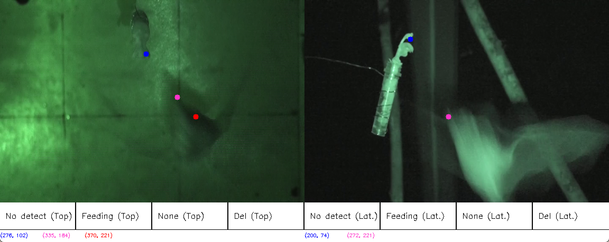

<!-- Encabezado -->
[![Colaboradores][contributors-shield]][contributors-url]
[![Forks][forks-shield]][forks-url]
[![Estrellas][stars-shield]][stars-url]
[![Issues][issues-shield]][issues-url]
[![MIT License][license-shield]][license-url]

<!-- Título -->
<br />
<div align="center">

<h3 align="center">DualVideoMotionTracker</h3>
  <p align="center">
    Proyecto en Python para rastrear puntos en dos videos sincronizados, con selección interactiva de frames y marcado de puntos. Python project to track points in two synchronized videos, with interactive frame selection and point marking features.
    <br />
    <a href="https://github.com/andres-merino/DualVideoMotionTracker/issues">Reportar un Problema</a>
    ·
    <a href="https://github.com/andres-merino/DualVideoMotionTracker/issues">Solicitar cambio</a>
    <br />
    <br />
    Abrir en (próximamente) 
    <br />
    <a href="https://github.com/andres-merino/DualVideoMotionTracker">
    
    </a>
  </p>
</div>


<!-- Cuerpo -->
## Sobre el Proyecto

Este proyecto fue elaborado para colaborar en la tesis de la Maestría en Biología de Andrea Caicedo. El proyecto involucra el análisis de videos de murciélagos aproximándose a una flor, con tomas desde una vista lateral y una superior. El objetivo es guardar la información sobre cómo se acerca el murciélago a la flor, así como registrar si el murciélago no está presente en el video o si se está alimentando.

### Construido con


 


## Guía de Uso

**DualVideoMotionTracker** es un proyecto en Python diseñado para rastrear puntos de interés en dos videos sincronizados mediante una selección interactiva de frames y marcado de puntos. Esta herramienta permite marcar y registrar puntos específicos en videos capturados desde dos perspectivas diferentes de un objeto o sujeto en movimiento, y exporta los datos a un archivo CSV.

### Requisitos

Para ejecutar el script, es necesario tener instalados los siguientes paquetes de Python:
```python
pip install opencv-python numpy pandas
```

### Archivos Requeridos

1. **Videos de Entrada:** Se necesitan dos videos sincronizados para el rastreo:
   - Uno desde la perspectiva **dorsal** (superior).
   - Otro desde la perspectiva **lateral**.
   
   Los videos deben estar en el directorio adecuado, y sus rutas deben especificarse al llamar a la función principal.

2. **Archivo de Salida:** El script generará un archivo CSV con las coordenadas de los puntos rastreados. Debe especificarse una ruta para este archivo de salida.

### Uso de la Función

La función principal para ejecutar el procesamiento es `process_videos()`, la cual se usa de la siguiente forma:

```python
# Rutas de los archivos de video
video_path_dorsal = "videos/6-top.mp4"
video_path_lateral = "videos/6-lat.mp4"

# Ruta del archivo de salida
output_excel_path = "data/output_points.csv"

# Procesamiento de los videos desde frames específicos
process_videos(video_path_dorsal, video_path_lateral, output_excel_path, start_frame_top=1, start_frame_lat=0)
```

#### Parámetros de la Función

- **video_path_dorsal:** Ruta al archivo de video desde la perspectiva dorsal.
- **video_path_lateral:** Ruta al archivo de video desde la perspectiva lateral.
- **output_excel_path:** Ruta donde se guardará el archivo CSV con las coordenadas de los puntos rastreados.
- **start_frame_top (opcional):** Número de frame inicial para el video dorsal.
- **start_frame_lat (opcional):** Número de frame inicial para el video lateral.

### Interfaz y Marcado de Puntos

Al ejecutar el script, se abrirá una ventana dividida, mostrando ambos videos como en la siguiente imagen:



Los usuarios pueden interactuar de la siguiente manera:

1. **Marcado de Puntos:** Hacer clic en los puntos de interés en cada video para registrar sus coordenadas. El script está configurado para registrar hasta **tres puntos por frame y por cámara**.

2. **Opciones de Registro en la Barra Inferior:**
   - **No detect (Top/Lat):** Indica que no se ha detectado al sujeto en el frame actual.
   - **Feeding (Top/Lat):** Señala que el murciélago está alimentándose.
   - **None (Top/Lat):** Señala que el murciélago no está en la imagen.
   - **Del (Top/Lat):** Permite borrar el último registro realizado en el frame actual.

### Sincronización

La sincronización entre ambos videos se realiza ajustando los parámetros `start_frame_top` y `start_frame_lat` en la función `process_videos()`. Esto permite alinear manualmente los videos, garantizando que ambos inicien en el momento correcto.

### Salida de Datos

El script genera un archivo CSV con las coordenadas de los puntos rastreados. El formato de salida es el siguiente:

| Left Point 1 | Left Point 2 | Left Point 3 | Right Point 1 | Right Point 2 | Right Point 3 |
|--------------|--------------|--------------|---------------|---------------|---------------|
| (0, 0)       | (0, 0)       | (0, 0)       | (0, 0)        | (0, 0)        | (0, 0)        |
| (270, 118)   | (291, 218)   | (440, 251)   | (199, 97)     | (-2, -2)      | (-2, -2)      |

Cada fila representa las coordenadas de los puntos en ambos videos para cada frame procesado. Los valores `(-2, -2)` indican que el punto no fue marcado en ese frame.

## Créditos

**Andrés Merino** (aemerinot@gmail.com) 

- Docente-Investigador en Pontificia Universidad Católica del Ecuador
- Fundador del [Proyecto Alephsub0](https://www.alephsub0.org/about/)
  
  [![LinkedIn][linkedin-shield]][linkedin-url-aemt]

## Licencia

Distribuido bajo la licencia MIT. 

[![MIT License][license-shield]][license-url]


<!-- MARKDOWN LINKS & IMAGES -->
[contributors-shield]: https://img.shields.io/github/contributors/andres-merino/DualVideoMotionTracker.svg?style=for-the-badge
[contributors-url]: https://github.com/andres-merino/DualVideoMotionTracker/graphs/contributors
[forks-shield]: https://img.shields.io/github/forks/andres-merino/DualVideoMotionTracker.svg?style=for-the-badge
[forks-url]: https://github.com/andres-merino/DualVideoMotionTracker/forks
[stars-shield]: https://img.shields.io/github/stars/andres-merino/DualVideoMotionTracker?style=for-the-badge
[stars-url]: https://github.com/andres-merino/DualVideoMotionTracker/stargazers
[issues-shield]: https://img.shields.io/github/issues/andres-merino/DualVideoMotionTracker.svg?style=for-the-badge
[issues-url]: https://github.com/andres-merino/DualVideoMotionTracker/issues
[license-shield]: https://img.shields.io/github/license/andres-merino/DualVideoMotionTracker.svg?style=for-the-badge
[license-url]: https://es.wikipedia.org/wiki/Licencia_MIT
[linkedin-shield]: https://img.shields.io/badge/linkedin-%230077B5.svg?style=for-the-badge&logo=linkedin&logoColor=white
[linkedin-url-aemt]: https://www.linkedin.com/in/andrés-merino-010a9b12b/
